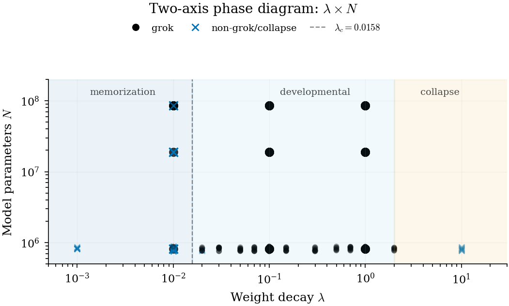

# Grokking Diagnostics

[](https://huggingface.co/datasets/lucky-verma/grokking-diagnostics-runs)
[](https://opensource.org/licenses/Apache-2.0)
[](https://www.python.org/downloads/)

Code, data, formal verification, and reproducibility artifacts for:

> **Weight Decay Regimes in Grokking Transformers: Cheap Online Diagnostics**
> Lucky Verma. Independent Researcher. 2026.
> [Dataset](https://huggingface.co/datasets/lucky-verma/grokking-diagnostics-runs)

## Artifact Contract

Use this repository to compute cheap attention-head diagnostics during
transformer training and to audit the paper's aggregate-backed claims.

The reusable object is:

- a small Python package for order parameters from attention tensors;
- paper figures and aggregate JSONs with provenance manifests;
- numerical verification scripts for public headline values;
- Lean 4 checks for the diagnostic identities.

This repository does not claim one-command retraining of every run or full
end-to-end regeneration of every figure from raw logs. Raw per-run records live
in the companion dataset, and the supported public surface is the package,
figures, aggregate JSONs, selected scripts, coverage manifest, and verifier.

## TL;DR

Two cheap online diagnostics, **mean pairwise attention-head cosine similarity** (`s̄`) and **entropy standard deviation across heads** (`σ_H`), track grokking phase regimes from attention activations alone, at ~3% wall-clock overhead in the reported setting. They complement Hessian-based diagnostics at lower compute cost. We map a 2-axis (weight-decay × model-size) regime diagram across 1,120 modular-arithmetic transformer runs (0.82M-85M parameters) and bound architecture-specificity with three horizon-matched cross-architecture scope probes (4L MLP, 4L LSTM, 4L Mamba; 350 additional runs).



## What's in this repository

| Directory | Contents |
|---|---|
| `grokking_diag/` | Python package (`pip install -e .`): `metrics.py` (s̄, σ_H, PR_norm), `predictor.py` (retention-classifier aggregator), `cli.py` |
| `eval/` | Aggregate JSONs cited in the paper: `multitask_logistic.json`, `multitask_summary.json`, `intervention_stats.json`, `holdout_retention.json`, `c1_empirical_validation.json`, cross-arch fits, and compact canonical aggregates under `eval/aggregates/` |
| `eval/scripts/` | Selected aggregation and figure-regeneration scripts for the public artifact surface |
| `docs/` | Machine-readable provenance map (`paper_sources.json`), coverage dashboard (`COVERAGE.{md,json}`), and release checklist |
| `scripts/` | `download_dataset.py`, `regenerate_figures.sh`, `verify_numerical_claims.py` |
| `figures/` | All 11 paper figures (PDF + PNG) |
| `lean_proofs/` | Lean 4 formal verification of diagnostic identities (A1, B1, C1, E1) under mathlib v4.29.0 |
| `CITATION.cff` | Machine-readable citation metadata |

The manuscript PDF is not tracked in this repository. Use the arXiv or venue record for archival paper versions once posted.

## Install

```bash
git clone https://github.com/lucky-verma/grokking-diagnostics.git
cd grokking-diagnostics
python3 -m pip install -e .
make validate
```

## Quick start

```python
from grokking_diag import compute_metrics

# attention weights from any transformer forward pass
# shape: list of (batch, heads, seq, seq) tensors per layer
attn_per_layer = [model.layers[i].attn.weights for i in range(model.n_layers)]

metrics = compute_metrics(attn_per_layer)
# {"mean_similarity": 0.93, "entropy_std": 0.18, "PR_norm": 0.71, ...}

# Phase identification on canonical 4L8H modular-arithmetic transformers:
#   Phase 1 (sync, near grokking):     mean_similarity in [0.93, 0.99], entropy_std rising
#   Phase 2 (differentiation):         mean_similarity dips to ~0.88, entropy_std peaks
#   Phase 5 (observed late collapse):  PR_norm < 0.2 on canonical seed-42
```

CLI metadata and aggregate-feature interface:

```bash
grokking-diag info
grokking-diag predict --features '{"scale": 1, "n_layers": 4, "d_model": 128, "n_heads": 8, "wd": 0.1, "train_acc": 1.0, "test_acc": 0.7, "sim_mean": 0.93, "ent_std": 0.18}'
```

## Reproducibility

Every numerical claim in the paper traces through `docs/paper_sources.json` to a specific aggregate JSON in `eval/`, and from there to raw per-run records in the [dataset](https://huggingface.co/datasets/lucky-verma/grokking-diagnostics-runs). To run the lightweight reviewer checks from the shipped aggregate surface:

```bash
python scripts/verify_numerical_claims.py
bash scripts/regenerate_figures.sh
```

The verification script checks every public aggregate-backed headline number and exits non-zero on any mismatch beyond floating-point tolerance. `scripts/regenerate_figures.sh` regenerates the selected public figures whose generation scripts are bundled here and then reruns the numerical verifier. The full raw-run dataset can be downloaded separately:

```bash
python scripts/download_dataset.py --cohort all
```

Full retraining and full end-to-end regeneration of every paper figure from raw runs are not claimed as one-command artifacts in this lightweight public repository.

Common replication targets:

```bash
make validate             # syntax + aggregate numerical checks + CLI metadata
make install-figures      # install matplotlib before figure regeneration
make figures              # regenerate selected bundled figures, then verify numbers
make install-data         # install Hugging Face Hub before dataset download
make dataset-aggregates   # download aggregate JSONs from the companion dataset
make test                 # pytest suite; requires make install-dev
make lean                 # Lean diagnostic checks; requires Lean/lake
```

## Lean 4 formal verification

Diagnostic identity properties (A1 three-regime competition, B1 large-WD collapse, C1 `PR_norm` coefficient-of-variation identity, E1 head-dimension capacity bound) are formally verified against mathlib v4.29.0:

```bash
cd lean_proofs
lake build Diagnostics
# expects: clean build, no `sorry`, no errors
```

These proofs establish *well-formedness* of the diagnostic identities (bounds, identities, rank properties); they do not formalise the empirical experimental claims, which remain JSON-traced via the provenance map.

## Key results

| Quantity | Value (95% CI) | Provenance |
|---|---|---|
| Critical weight decay λ_c (canonical 4L8H d=128 mod_+) | 0.0158 [0.0109, 0.0200] | logistic fit, N=210 |
| Power-law exponent ν | 0.757 [0.725, 0.799] | n=140 grok-positive runs |
| 4L MLP h=512 cross-arch λ_c | 0.0511 [0.0495, 0.0591] | n=13/70 grok |
| 4L LSTM h=512 cross-arch λ_c | 0.0365 [0.0299, 0.0473] | n=22/70 grok |
| 4L Mamba d=128 cross-arch λ_c | 0.0144 [0.0106, 0.0160] | n=46/70 grok |
| Cohen's d (add vs random null) | 1.11 | n=12 vs n=15 |
| C1 identity max error | 1.73e-6 | 183 layer-epoch rows |
| Causal intervention paired Δ (peak σ_H, λ=0.05) | -0.055±0.046, p_t=4.5e-3, d=-1.190 | n=10 paired |

Tested universality classes (ν=1/2 mean field, ν=0.63 3D Ising) lie outside the empirical CI, so we report ν as empirical and defer universality-class identification to denser finite-size-scaling data-collapse work.

The Mamba selective-state-space architecture's empirical λ_c CI overlaps the transformer canonical CI without our paper claiming a shared transition mechanism; per-architecture canonical λ should be recalibrated rather than transferred across architectures.

## Citation

```bibtex
@article{verma2026grokking,
  title   = {Weight Decay Regimes in Grokking Transformers: Cheap Online Diagnostics},
  author  = {Verma, Lucky},
  year    = {2026}
}
```

Or use [`CITATION.cff`](CITATION.cff) for machine-readable citation metadata.

## License

Code: [Apache 2.0](LICENSE). Data: [CC-BY-4.0](https://creativecommons.org/licenses/by/4.0/). Paper: CC BY 4.0.

## Contact

Open an [issue](https://github.com/lucky-verma/grokking-diagnostics/issues) or email luckyv1@umbc.edu.
